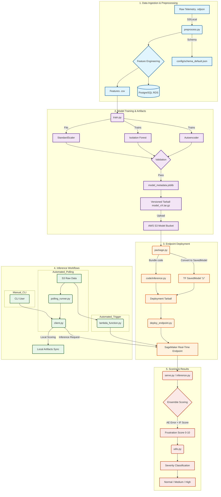
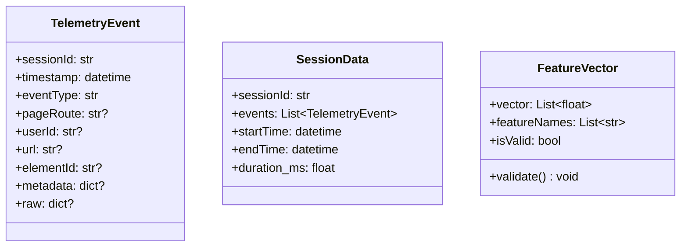
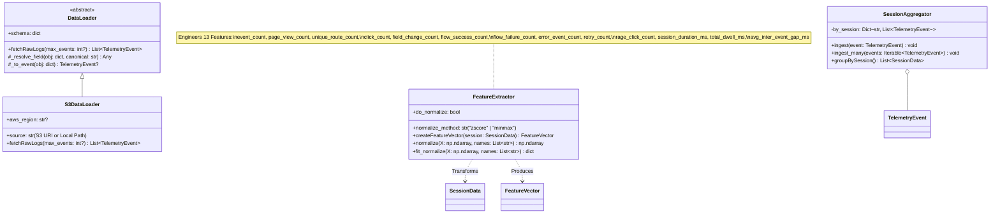
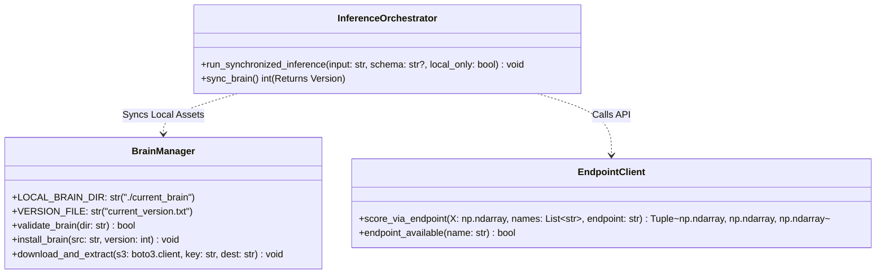
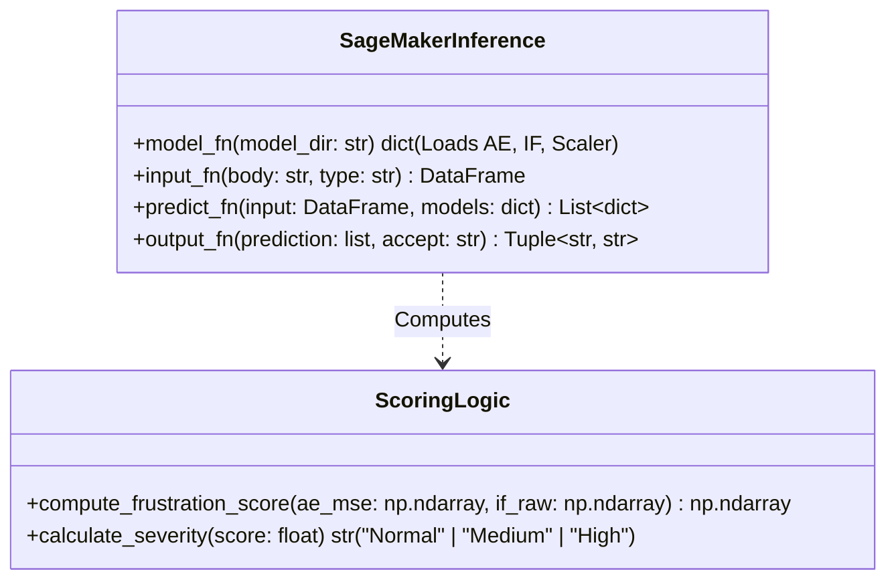

# Telemetry Frustration Scoring Pipeline Visualization

This document provides a clean, modern, and sectionalized view of the machine learning pipeline for session-level frustration scoring.

## 🏗️ Pipeline Overview

---

## 📂 Component Breakdown

### 1. Data Ingestion & Preprocessing
*   **`preprocess.py`**: The entry point for data. It aggregates raw telemetry events into session-level features.
*   **`config/schema_default.json`**: Defines how telemetry events are mapped to numerical features.
*   **Storage**: Features can be saved as CSV for training or pushed to a **PostgreSQL RDS** instance for long-term analytics.

### 2. Model Training & Artifacts
*   **`train.py`**: Trains the ensemble model (Autoencoder + Isolation Forest).
*   **Validation**: Before any model is uploaded, it must pass a battery of tests (finite scores, discrimination check, range check).
*   **Artifacts**: Versioned models are stored in S3 as `model_vX.tar.gz`.

### 3. Endpoint Deployment
*   **`package.py`**: Prepares artifacts for SageMaker. It converts Keras models to TensorFlow's `SavedModel` format and bundles the inference logic.
*   **`deploy_endpoint.py`**: Provisions the infrastructure (AWS SageMaker) to host the model for real-time requests.

### 4. Inference Workflows
*   **`polling_runner.py` / `scheduler.py`**: Continuously monitors S3 for new data and triggers inference.
*   **`client.py`**: A versatile tool that can perform local scoring (using synced artifacts) or call the SageMaker endpoint.
*   **`lambda_function.py`**: Provides a serverless trigger mechanism for event-driven inference.

### 5. Scoring & Results
*   **`serve.py` / `inference.py`**: The logic running inside the SageMaker container.
*   **`utils.py`**: Shared logic for calculating the final 0-10 Frustration Score and determining severity.
*   **Severity**: Sessions are categorized as **Normal (<7)**, **Medium (7-9)**, or **High (≥9)**.

---

## 📐 Component UML Diagrams

This section provides a structural view of the key Python components, showing their internal class hierarchies, field-level data structures, and explicit method signatures.

### 1. Data Structures (`preprocess.py`)
These classes define the data contract as it flows through the pipeline.

### 2. Preprocessing & Transformation (`preprocess.py`)
Explicit mapping of data ingestion and feature engineering.

### 3. Inference Orchestration (`client.py`)
Coordinates local scoring and SageMaker interactions.

### 4. SageMaker Interface (`serve.py` / `inference.py`)
Internal logic for the SageMaker Inference Container.

---
*Visualization generated by Gemini CLI*
