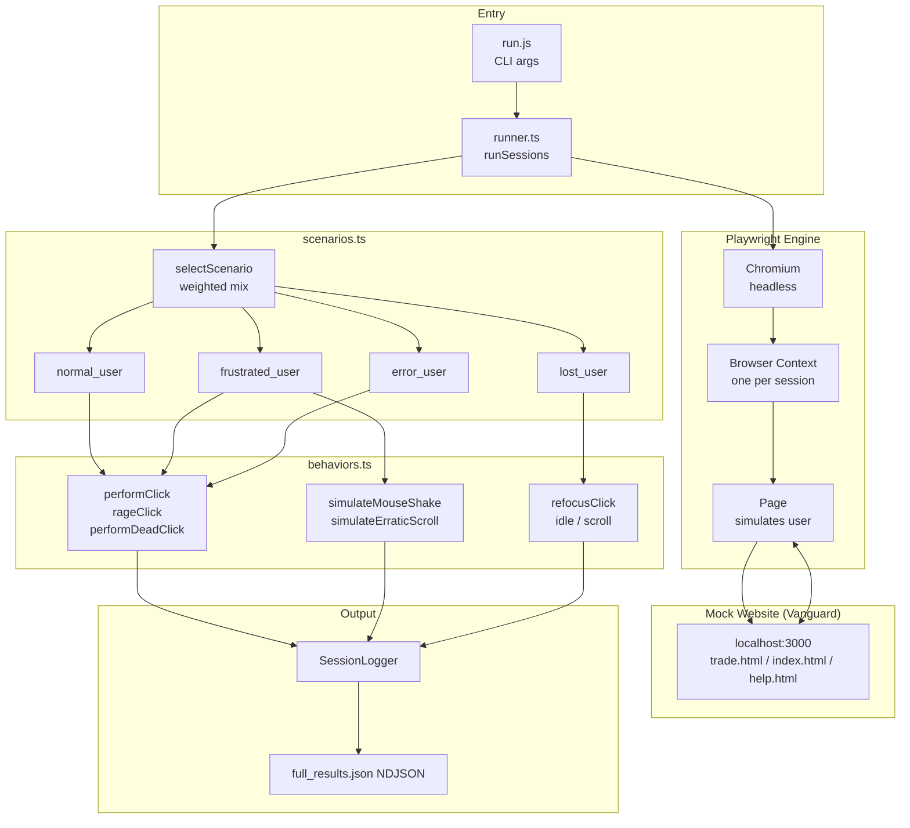
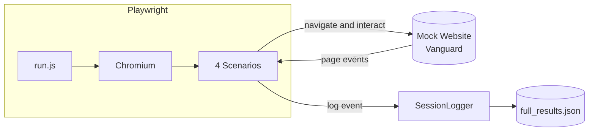

# How Playwright Works in This System

## Architecture Diagram

---

## Simplified: Playwright Data Flow

---

## Flow Summary

| Step | Component | Role |
|------|-----------|------|
| 1 | run.js | Parse `--baseUrl`, `--sessions`, `--scenarioMix`, `--output` |
| 2 | runner.ts | Launch Chromium, run sessions in loop |
| 3 | selectScenario | Pick scenario by mix (normal 40%, frustrated 30%, lost 20%, error 10%) |
| 4 | Page + Mock Website | Playwright-controlled page visits Mock site (trade.html, etc.) |
| 5 | scenarios.ts | Run scenario: normal clicks, frustrated rage+shake, lost hesitation+backtrack, error 404 |
| 6 | behaviors.ts | Actions: rageClick, mouse shake, erratic scroll, refocus, etc. |
| 7 | SessionLogger | Write events to NDJSON file |
| 8 | full_results.json | Output for Phase 2 (Matomo, AWS) |

---

## One-line Summary

> **Playwright launches a headless browser, visits the Vanguard Mock site, simulates user behavior across 4 scenarios (clicks, scrolls, idle, etc.), and logs events to NDJSON via SessionLogger for downstream analysis.**
